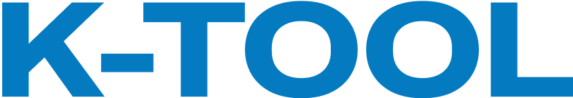

# 

A freelanced company website for K-TOOL Engineering, a precision engineering firm based in Malaysia. Visit it [here.](https://ktoolengineering.com)

Shipped quickly to align with strict client deadlines, using Next.js.

## Features

- **Beautiful responsive, custom UI and animations:** developed using React.js and Motion animation library.
- **In-app contact and quote request email system:** customers can easily submit inquiries and quote requests on the website, which are directly sent to, formatted, and organised in the company's inbox. Implemented using Resend.
  - **Intermediate file storage using Cloudfare R2:** store files included in quote requests to then send over the SMTP protocol.
  - **Hybrid approach to rate-limiting:** based on IP and form field values, to prevent users/bots from spamming the form.
- **Comprehensive, long-term SEO strategy:** implemented essentials (e.g. social banners, robots.txt, sitemap) for optimal search presence, and progressively iterating on this to rank highly for more common domain-specific search terms.
- **Integrated analytics:** identify visitors over time and judge [success metric.](#success-metric)

## Success metric

The success is measured by the **total number of Requests for Quotes (RFQs) per month** generated from the website (i.e. how many visitors have we converted into potential clients).

Analytics has been integrated into the project to continuously track this over the long term.

## Contact

If you identify any issues or want something similar freelanced, contact hmw.geo@gmail.com.
